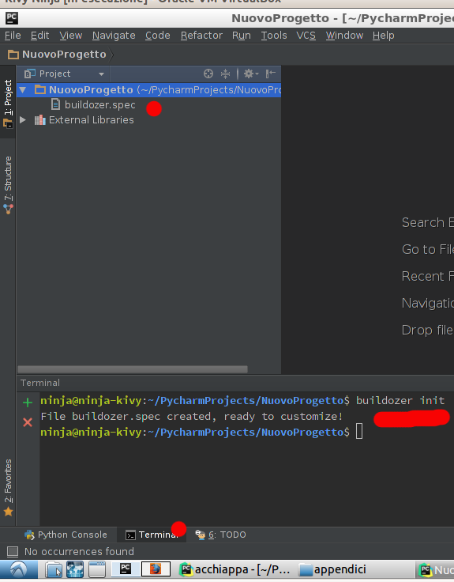
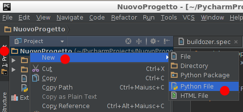
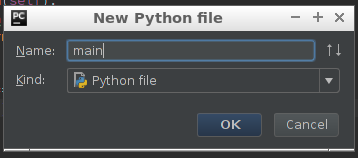

# Il File `buildozer.spec`

Ovvero: costruire una app da zero.

Quando venite a un coderdojo trovate una macchina virtuale con un progetto vuoto pronto per essere usato, ma 
cosa dovete fare se ne volete iniziare uno da soli?

Qui parleremo di come iniziare un progetto da zero e come modificare alcune cosettine per impostare l'icona e
l'immagine di partenza ( *Splash screen* ) come più ci piace.

## Nuovo progetto PyCharm

*File* -> *New Project*

Al posto di `untitled` scrivete il nome che volete dare al programma (niente spazi o caratteri strani)


## Iniziare un progetto buidozer

Aprite il terminale e digitate

```
buildozer init
```



Comparirà un file dal nome `buidozer.spec`: contiene le informazioni di come fare la vostra APP. Dopo lo guardiamo nel 
dettaglio ma per ora vediamo le cose principali da modificare:

Nome                 | Significato                           | Esempio Valore o Consigliato
---------------------|---------------------------------------|---------------
`title`              | Titolo APP (Viene visualizato)        | `Acchiappa la Talpa`
`package.name`       | Nome pacchetto (Tecnico)              | `acchiappa`
`package.domain`     | La vostra organizzazione              | `org.ninja`
`version`            | La Versione (usate il numero e cancellate il resto) | `1.0.0`
`requirments`        | Cosa serve alla vostra APP            | `kivy==1.9.1`
`android.p4a_dir`    | Dove si trova python for android      | `/home/ninja/.buildozer/android/python-for-android`

Per esempio in nuovo progetto io ho modificato le seguenti righe

```
title = Nuovo
package.name = nuovo
package.domain = org.mentor
version = 1.0.0
requirements = kivy==1.9.1
android.p4a_dir = /home/ninja/.buildozer/android/python-for-android
```

## Il file di main

Le APP fatte con buildozer iniziano sempre con un file `main.py`: aggiungiamo

* Tasto destro su progetto* -> *New* -> *Python File* -> `main`
 



Ora vi consiglio di fare il componente principale come `FloatLayout` dato che è molto versatile:

`main.py`
```python
from kivy.app import App
from kivy.uix.floatlayout import FloatLayout


class Nuova(FloatLayout):
    pass


class NuovaApp(App):
    def build(self):
        nuova = Nuova()
        return nuova


if __name__ == "__main__":
    NuovaApp().run()
```

Proviamola in locale con tasto destro su `main.py` e click nel menù di *Run `main`*. Una finestra nera.

Ora per provare la App riferitevi all'appendice [Compila e Installa](compila_e_installa.md). **Attenzione, la prima 
volta che fate la APP ci vuole MOLTO TEMPO**.

## I Dettagli di `buildozed.spec`

### `android.p4a_dir`

Se non avete una connessione a internet la riga

```
android.p4a_dir = /home/ninja/.buildozer/android/python-for-android
```
Diventa essenziale, senza questa buildozer cerchera di recuperere tutto da internet fallendo miseramente, se aveta la 
connessione potete rimuoverla: cercherà sempre di usare la migliore.

### `requirments`

E' molto importante e dichiara cosa volete usare nella vostra APP. Solitamente basterebbe indicare `kivy` ma...
per motivi esoterici che **non** voglio spiegare è meglio indicare anche la versione.

```
requirments = kivy==1.9.1
```

Se si vogliono usare anche altri moduli si possono mettere separandoli con una virgola. In particolare quando si
vuole usare la vibrazione serve anche `plyer` e `requirments` diventa 
```
requirments = kivy==1.9.1,player
```

### Icona e Splash Screen

Può essere **molto** simpatico usare una icona particolare e una immagine di presentazione mentre si fa partire la APP.
Di solito queste immagini si mettono in una cartella nel progetto: per fissare le idee la chiamiamo `data`. Bene se 
mettiamo una bella icona in data tipo `data/icon.png` e una schermata da caricare tipo `data/splash.jpg` nel
file `buildozer.spec` impostiamo

```
presplash.filename = %(source.dir)s/data/splash.jpg
icon.filename = %(source.dir)s/data/icon.png
```

### Orientamento e altri dettagli

Possiamo dire come la APP può essere orientata sullo schermo indicando 

```
orientation = landscape
```
per quello orizzontale o `portail` per quello verticale e `all` per entrambi.

Con `fullscreen` diciamo se la APP è o meno a schermo intero.

... infine i permessi: Se si vuole far vibrare il telefono bisogna chiedere il permesso, se si vuole andare su internet 
bisogna chiedere il permesso... insomma non si può fare nulla senza permesso:

```
android.permissions = VIBRATE,INTERNET
```

e tanti altri che non conosco.

