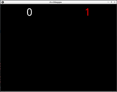

# Schermo con punteggi

Iniziamo a una applicazione vuota: un semplice schermo nero.

Nel progetto trovate già fatti i due file di scheletro per fare le applicazioni:

`main.py`

```python
from kivy.app import App
from kivy.uix.floatlayout import FloatLayout


class AcchiappaLaTalpa(FloatLayout):
    pass


class AcchiappaApp(App):
    def build(self):
        acchiappa = AcchiappaLaTalpa()
        return acchiappa


if __name__ == "__main__":
    AcchiappaApp().run()
```

`acchiappa.kv`
```kv
#:kivy 1.0.9

<AcchiappaLaTalpa>:
```

Proviamo a eseguire con tasto destro su `main.py` e **Run**: Schermo nero che possiamo chiudere.

## Punteggi

Vogliamo mettere in alto a sinistra il punteggio bianco delle talpe colpite e in alto a destra quello reosso delle talpe 
mancate.

Apriamo il file che descrive la grafica `acchiappa.kv` e aggiungiamo due `Label` ( *etichette* ) al componente 
`AcchiappaLaTalpa` facendo scrivere per ora i numeri fissi `0` e `1`: `<AcchiappaLaTalpa>` diventa

```kv
<AcchiappaLaTalpa>:
    Label:
        size_hint: None, None
        font_size: 70
        pos_hint: {"center_x": 0.25, "top": 0.99}
        text: "0"

    Label:
        size_hint: None, None
        color: 1,0,0,1
        font_size: 70
        pos_hint: {"center_x": 0.75, "top": 0.99}
        text: "1"
```

Eseguite di nuovo e troverete questo:



Provate ora a modificare i valori di `font_size`, `center_x` e `top` per vedere cosa succede... anche il colore può 
essere divertente dove 
 * `0,1,0,1` -> blu
 * `0,0,1,1` -> verde
 * `0.1,0.7,0.5` -> ?

Ora tornate ai valori originali e sostituite nel primo `text` `"0"` con `str(root.prese)` e `"1"` con 
`str(root.mancate)`. Stiamo dicendo di scrivere il valore delle talpe prese nella prima (sinistra) e di
quelle mancate nella seconda (destra).

Quindi:

```kv
<AcchiappaLaTalpa>:
    Label:
        size_hint: None, None
        font_size: 70
        pos_hint: {"center_x": 0.25, "top": 0.99}
        text: str(root.prese)

    Label:
        size_hint: None, None
        color: 1,0,0,1
        font_size: 70
        pos_hint: {"center_x": 0.75, "top": 0.99}
        text: str(root.mancate)
```

Eseguite e .... **BOOOM!!!!**

```
   ...
   File "/home/ninja/PycharmProjects/acchiappa/tutorial/acchiappa.kv", line 15, in <module>
     text: `str(root.mancate)`
   File "kivy/weakproxy.pyx", line 19, in kivy.weakproxy.WeakProxy.__getattr__ (kivy/weakproxy.c:1128)
 
   File "/usr/lib/python2.7/dist-packages/kivy/lang.py", line 2011, in _apply_rule
     value, rule, rctx['ids'])
   File "/usr/lib/python2.7/dist-packages/kivy/lang.py", line 1654, in create_handler
     cause=tb)
```

Dobbiamo scrivere nella logica (`main.py`) che il componente `AcchiappaLaTalpa` contiene due numeri: `prese` e 
`mancate`.

Aggiungete all'inizio di `main.py`

```python
from kivy.properties import NumericProperty
```

e modificate la classe `AcchiappaLaTalpa` sempre di `main.py` in

```python
class AcchiappaLaTalpa(FloatLayout):
    prese = NumericProperty(0)
    mancate = NumericProperty(0)
```

Ora eseguite e tutto funzionerà con i due valori a `0`.

## Il punteggio cambia da solo

La cosa bella ora è che **tutte le volte che modifichiamo `prese` o `mancate` il nuovo valore viene visualizzato**.

Per provarlo costruiamo una funzione `start()` che poi useremo per iniziare il gioco dove cambiamo il punteggio:

Dentro la classe `AcchiappaLaTalpa` aggiungiamo

```python
    def start(self):
        self.prese = 0
        self.mancate = 0
```

Quindi tutta la classe `AcchiappaLaTalpa` diventa:

```python
class AcchiappaLaTalpa(FloatLayout):
    prese = NumericProperty(0)
    mancate = NumericProperty(0)

    def start(self):
        self.prese = 0
        self.mancate = 0
```

Ora dobbiamo chiamare la funzione `start()` quando costruiamo il gioco, quindi modifichiamo `build()` della classe
`AcchiappaApp` aggiungendo la chiamata a `start()`:

```python
class AcchiappaApp(App):
    def build(self):
        acchiappa = AcchiappaLaTalpa()
        acchiappa.start()
        return acchiappa
```

Ora eseguite prevando a cambiare i valori di `self.prese` e `self.mancate`: vedrete che non verrà più scritto
`0`, ma quello che scrivete voi (sempre e solo numeri).

* [**NEXT** La comparsa di una talpa](una_talpa.md)
* [**PREV** Indice](start.md)
* [**INDEX** Indice](start.md)

