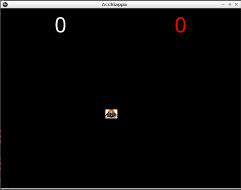

# La comparsa di una talpa

Siamo pronti a far comparire una talpa: Per prima cosa definiamo la classe `Talpa` tra le logiche di `main.py` e poi la 
parte grafica in `acchiappa.kv`.

Le talpe non sono altro che bottoni e per ora non fanno altro. In testa a `main.py` aggiungere la definizione di 
bottone:

```python
from kivy.uix.button import Button
```

e dopo le la classe che è un `Button` senza niente dentro

```python
class Talpa(Button):
    pass
```

In `acchiappa.kv` aggiungiamo la descrizione della talpa dove dobbiamo dire che immagine usare. Le immagini sono 
nella directory `data` e hanno un nome tipo `talpa<nr>.jpg` dove `<nr>` è un numero che va da 1 a 5. Per ora usiamo solo
una immagine: `data/tapla1.jpg`.

```kv
<Talpa>:
    size_hint: 0.05, 0.05
    pos_hint: {"center_x": 0.3, "center_y": 0.7}
    background_normal: 'data/talpa1.jpg'
```

Abbiamo fissato le dimensioni in proporzione allo schermo e una posizione fissa. Ci manca solo aggiungere questa
talpa: lo facciamo costruendo una nuova funzione `talpa()` nella classe `AcchiappaLaTalpa` che per ora chiamiamo da
`start()` per provarla:

Quindi `AcciappaLaTalpa` diventa:

```python
class AcchiappaLaTalpa(FloatLayout):
    prese = NumericProperty(0)
    mancate = NumericProperty(0)

    def start(self):
        self.prese = 0
        self.mancate = 0
        self.talpa()

    def talpa(self, *args):
        talpa = Talpa()
        self.add_widget(talpa)
```

Se proviamo vedremo comparire la talpa con una immagine. Se proviamo cambiare il numero in `'data/talpa1.jpg'` 
con `2` o `3` vedremo altre talpe. Cambiando il valore di `center_x` e `center_y` sposteremo la talpa per lo schermo.

## In un posto a caso

Per posizionare a caso la talpa bisogna usare la funzione `random.random()` sia per `center_x` che per `center_y`.

Si possono usare le funzioni anche nella descrizione grafica e anche in questo caso bisogna dichiararle: in alto in
`acchiappa.kv` dopo la scritta `#:kivy 1.0.9` aggiungere la riga:

```python
#:import random random.random
```

Questa riga dice che possiamo usare la funzione `random()` come se fosse `random.random()`

Modifichiamo quindi `<Talpa>` come:

```kv
<Talpa>:
    size_hint: 0.05, 0.05
    pos_hint: {"center_x": 0.05 + 0.9 * random(), "center_y": 0.05 + 0.9 * random()}
    background_normal: 'data/talpa1.jpg'
```

Provate ... a ogni avvio la talpa coparirà in una posizione diversa!

## ... Con una immagine a caso

Aggiungete in alto al file `acchiappa.kv` un'altra riga

```python
#:import randint random.randint
```

e cambiate `<Talpa>` e quello che contiene con

```kv
<Talpa>:
    size_hint: 0.05, 0.05
    pos_hint: {"center_x": 0.05 + 0.9 * random(), "center_y": 0.05 + 0.9 * random()}
    background_normal: 'data/talpa' + str(randint(1, 5)) + '.jpg'
```

A ogni partenza una talpa diversa.

## Quando tappiamo o clickiamo il punteggio aumenta

Per prima cosa facciamo una funzione `talpa_colpita()` nella classe `AcchiappaLaTalpa`, chiameremo questa funzione
quando viene *pressata* la talpa (`on_press`):

**Da adesso in poi riporterò solo le funzioni dato che la classe `AcchiappaLaTalpa` inizia a essere grandicella.**

```python
    def talpa_colpita(self, talpa):
        self.prese += 1
```

Ora dobbiamo *agganciare* questa funzione a quando si verifica la codizione `on_press` ( *pressata* ) sulla talpa. La
funzione `talpa()` diventa quindi:

```python
    def talpa(self, *args):
        talpa = Talpa()
        talpa.bind(on_press=self.talpa_colpita)
        self.add_widget(talpa)
```

Provate a eseguire, **cliccando sulla talpa vedrete il punteggio aumentare!**

## ... E la talpa scompare

Quando una talpa viene colpita deve essere rimossa. Creiamo quindi una funzione `rimuovi_talpa()` e chiamiamola
da `talpa_colpita()`:

```python
    def talpa_colpita(self, talpa):
        self.prese += 1
        self.rimuovi_talpa(talpa)

    def rimuovi_talpa(self, talpa):
        self.remove_widget(talpa)
```

## Riassumendo



`main.kv`
```python
from kivy.app import App
from kivy.uix.button import Button
from kivy.uix.floatlayout import FloatLayout
from kivy.properties import NumericProperty


class Talpa(Button):
    pass


class AcchiappaLaTalpa(FloatLayout):
    prese = NumericProperty(0)
    mancate = NumericProperty(0)

    def start(self):
        self.prese = 0
        self.mancate = 0
        self.talpa()

    def talpa(self, *args):
        talpa = Talpa()
        talpa.bind(on_press=self.talpa_colpita)
        self.add_widget(talpa)

    def talpa_colpita(self, talpa):
        self.prese += 1
        self.rimuovi_talpa(talpa)

    def rimuovi_talpa(self, talpa):
        self.remove_widget(talpa)
```

`acchiappa.kv`
```kv
#:kivy 1.0.9
#:import random random.random
#:import randint random.randint

<Talpa>:
    size_hint: 0.05, 0.05
    pos_hint: {"center_x": 0.05 + 0.9 * random(), "center_y": 0.05 + 0.9 * random()}
    background_normal: 'data/talpa' + str(randint(1, 5)) + '.jpg'

<AcchiappaLaTalpa>:
    Label:
        size_hint: None, None
        font_size: 70
        pos_hint: {"center_x": 0.25, "top": 0.99}
        text: str(root.prese)

    Label:
        size_hint: None, None
        color: 1,0,0,1
        font_size: 70
        pos_hint: {"center_x": 0.75, "top": 0.99}
        text: str(root.mancate)
```

* [**NEXT** La talpa animata](talpa_animata.md)
* [**PREV** Schermo con punteggi](punteggi.md)
* [**INDEX** Indice](start.md)
